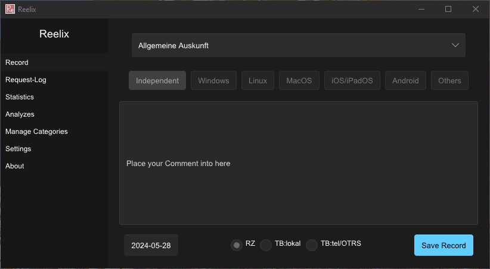

## About
This project aims to replace the "Neelix" program in the IT support of the University of Bamberg. Neelix was written around 2015-2017, and the source code seems to be lost. You need to have Java installed and set a variable for JAVA_HOME. The database server uses an unsupported Linux system.

Reelix aims to redo all of this. It is written in Rust and built with [Slint](https://slint.dev/) as the UI framework. Reelix should run on every desktop OS after compilation. Officially supported are (yet) only Linux and Windows.

We are using the royalty-free license of Slint.

<figure>
    
    <figcaption>Home Page of Reelix Version 0.0.4</figcaption>
</figure>

# Roadmap To 1.0
- [ ] Feature parity with Neelix
- [ ] Config needs to be configurable from the GUI
- [ ] Build binaries for Windows, macOS, and Linux via GitLab pipelines

# Things to add

On the Record panel
- [x] Replace ComboBox with ComboBoxScroll
- [x] Operating System selection in certain categories (doesn't disable if Support OS selection is deactivated) (linked to [Go to Independent / Global Issues](#independent--global-issues))
- [x] A text box for comment info (implemented with LineEdit, waiting for new upstream version for text box placeholder, waiting for 1.6.1)[#5229](https://github.com/slint-ui/slint/discussions/5229)
- [ ] Select time for submitting (can't select yet, coming soon) Proper Date and Time picker widgets depend on upstream [Tracked in issue #46](https://github.com/slint-ui/slint/issues/46)
- [x] Select location of the issue
- [ ] Select the number of tickets you want to create at once
- [x] Submit button

On the Request-Log panel
- [ ] Dynamically created table sheet
- [ ] Show the latest 20 entries
- [ ] Ability to load older ones with an extra button
- [ ] Ability to remove accidentally created ones

On the Statistics panel
- [ ] Show stats from the last 7 days
- [ ] Option to ask for a specific date range
- [ ] Option to scroll back to the 7 days before the current week

On the Analysis panel
- [ ] Export SQL table to CSV or HTML
- [ ] Ability to select the date range

On the Category Management panel
- [x] Create categories (types)
- [x] Delete categories (types)

On the Settings panel
- [ ] Ability to set a database timeout
- [ ] Ability to set a database server with an IPv4 address (in the future IPv6 and maybe domain name)
- [ ] Ability to set a database port
- [ ] Ability to set a database name
- [ ] Ability to set a database username
- [ ] Ability to set a database password
- [ ] Check if it would work
- [x] Dark/light mode switch
- [ ] Save dark/light mode switch to config
- [ ] Theme switcher (fluent, cosmic, cupertino)
- [ ] Language selection

An Info panel
- [x] Show some information about the application 

### Independent / Global Issues
- [ ] High contrast mode
- [ ] Multilanguage support
- [ ] Full keyboard support
- [ ] Shortcuts to panels

ComboBoxScroll
- [x] Make the popup solid instead of transparent
- [x] Scrolling works
- [x] Theme works on it
- [x] ComboBoxScroll supports key inputs
- [x] ComboBoxScroll tab support
- [ ] Accessibility for blind people
- [x] Selected (string) callback
- [ ] Fix theme issue in light mode
- [x] Popup disappears if focus is shifted via tab and escape

RadioBoxes
- [ ] Change the selected color to be less vibrant

RadioButton
- [x] Works as intended
- [ ] Support all [common properties](https://releases.slint.dev/1.6.0/docs/slint/src/language/builtins/elements#common-properties)

More things will be added in the future.

# How to use

### The easy way 
Download the bin file for your operating system of choice.

### The hard way
1. You have to install `rustc` and `cargo` [(Rust Getting Started Guide)](https://www.rust-lang.org/learn/get-started)
2. Go to [the tutorial](https://releases.slint.dev/1.5.1/docs/tutorial/rust/introduction) and install [`cargo-generate`](https://github.com/cargo-generate/cargo-generate)
    ```
    cargo install cargo-generate
    ```
3. Clone this repo
    ```
    git clone https://gitlab.rz.uni-bamberg.de/ba4ju8/reelix/
    ```
4. Change directory into it    
    ```
    cd ./reelix
    ```
5. Smash your head against the wall
6. Build the binary
    ```
    cargo build
    ```

If this doesn't work, good luck.

# Setting up the database
Install MariaDB or MySQL on a Linux system of your choice. Recommended: latest stable release of Debian, currently 12.

From : [Digitalocean](https://www.digitalocean.com/community/tutorials/how-to-install-mariadb-on-debian-11)

```
sudo apt update
sudo apt install mariadb-server
sudo mysql_secure_installation
```

Check if it worked
```
sudo systemctl status mariadb
```

Go into mariadb
```
sudo mariadb
```

Create a Database
```
CREATE DATABASE your_database_name;
```

Create a User with password
```
CREATE USER 'your_database_username'@'localhost' IDENTIFIED BY 'your_database_password';
```

Then grant the user all permissions on the database (can be insecure)
```
GRANT ALL PRIVILEGES ON your_database_name.* TO 'your_database_username'@'%';
```

Then grant the user acses to the the database from every host (can be insecure)
```
GRANT ALL PRIVILEGES ON *.* TO 'your_database_username'@'%' IDENTIFIED BY 'your_database_password' WITH GRANT OPTION;
```
